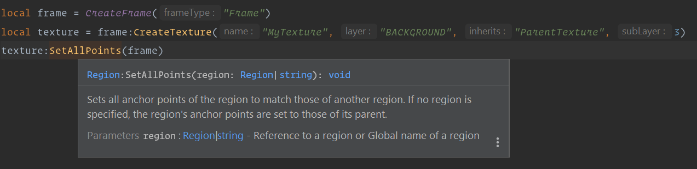

This is a documentation representation of the World of Warcraft Lua API to be used with the [EmmyLua plugin] for [IntelliJ IDEA].



### Documentation generated from Blizzard's FrameXML API documentation

The API Documentation is generated from the WoW Source API files by executing:

```bash
lua ./GenerateFromAPIDocumentation.lua
```

### Global functions generated from Wowpedia

The Global functions are parsed from the crowdsourced warcraft.wiki.gg website, via the https://warcraft.wiki.gg/wiki/Global_functions page, and all the content is extracted to the `GlobalFunctions/GlobalFunctions.lua` file. To run the script execute:

```bash
lua ./GenerateFromWikiDocumentation.lua
```

> **Note:** We need two lua libraries to run the Wowpedia parser: **lua-socket** and **lua-sec**

### Widgets API

The Widgets API was manually edited from the old Wowprogramming website (no longer available) and doesn't have any automated generation as of now.

### Popular libraries

Documentation of popular libraries (for now only LibStub) is provided to get code completion when using such libraries. You will still need to include those libraries into your project yourself.

[EmmyLua plugin]: https://github.com/EmmyLua/IntelliJ-EmmyLua
[IntelliJ IDEA]: https://www.jetbrains.com/idea/
[Warcraft Wiki]: https://warcraft.wiki.gg/
